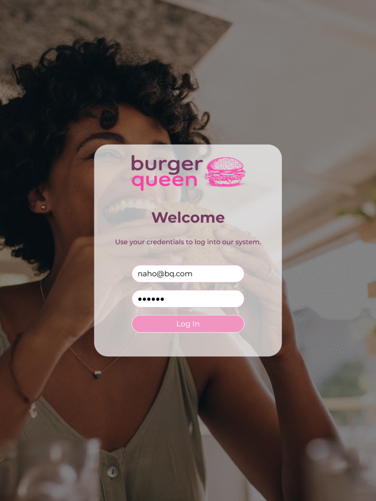
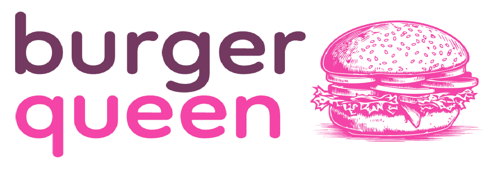
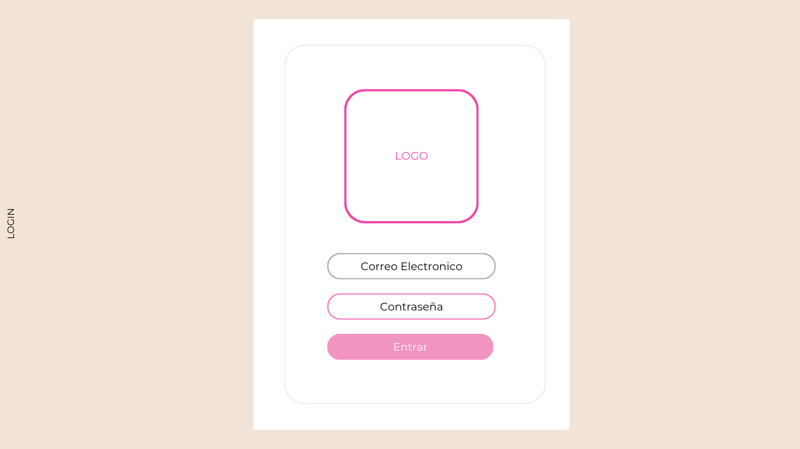
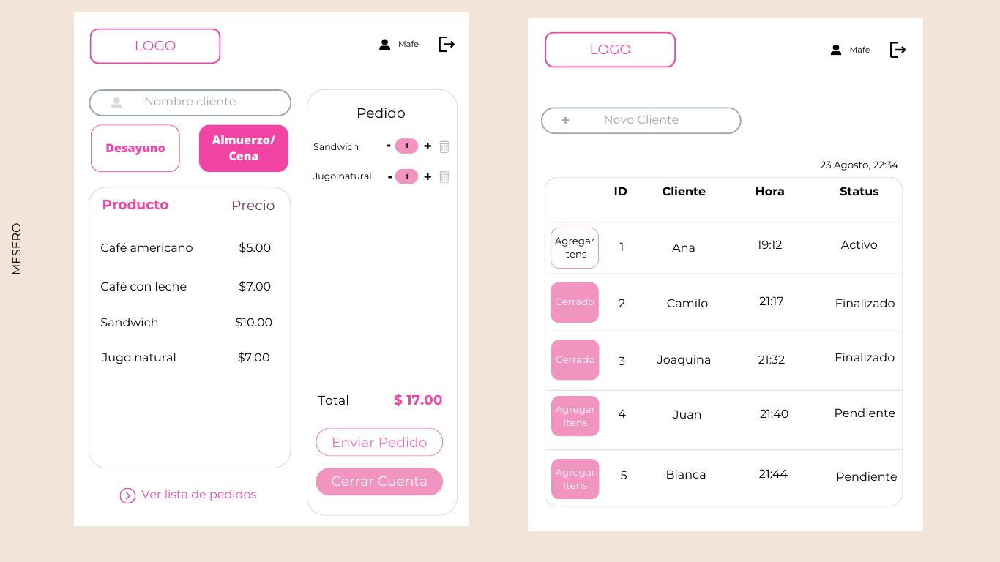
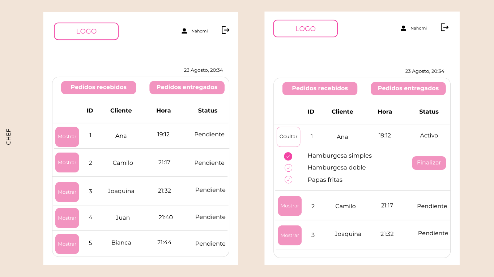
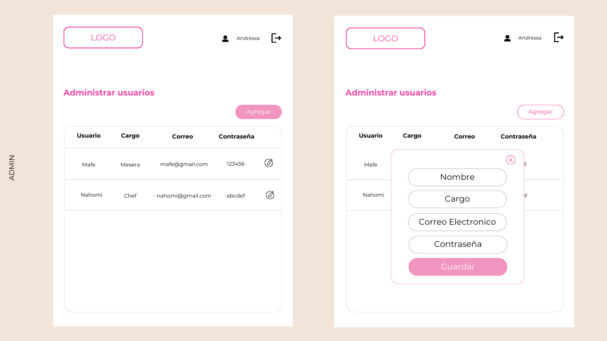
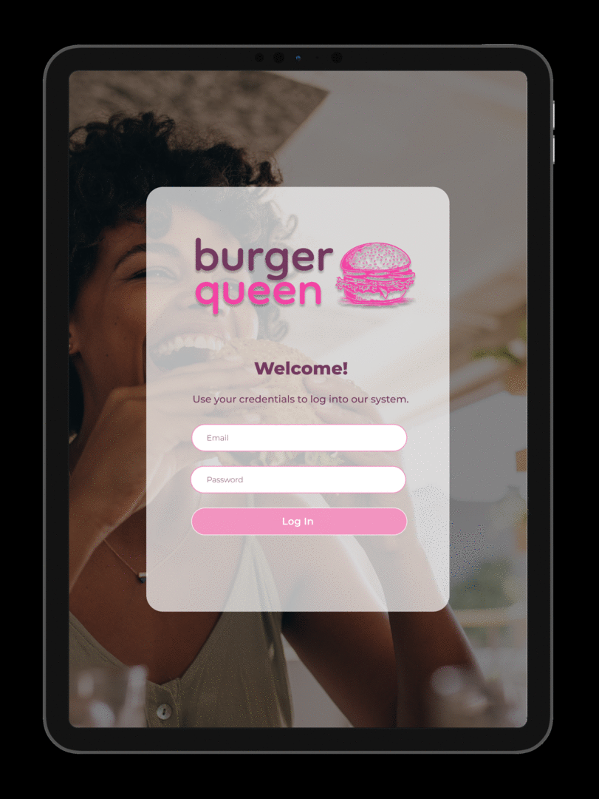

# Burger Queen

## Indice

* [1. Preámbulo](#1-preámbulo)
* [2. Características principales](#2-características-principales)
* [3. Vista previa de la app](#3-vista-previa-de-la-app)
* [4. Diseño y Prototipos](#4-diseño-y-prototipos)
* [5. Tecnologias utilizadas](#5-tecnologias-utilizadas)
* [6. Desarrolladoras](#6-desarrolladoras)

***

## 1. Preámbulo

[Burger Queen](https://burgerqueen-lab.netlify.app/) es una aplicación que tiene como objetivo agilizar la toma de pedidos y la gestión de órdenes en el restaurante de hamburguesas "Burger Queen". Con el crecimiento constante del restaurante, necesitamos una solución eficiente que permita a los miembros del personal tomar pedidos de manera rápida y precisa mediante el uso de tablets. Además, la aplicación facilitará la comunicación entre el personal de servicio y la cocina, garantizando que los pedidos se preparen y sirvan de manera oportuna.

## 2. Características principales

1. **Registro de Usuarios**: La aplicación permite registrar y gestionar cuentas de usuario para el personal del restaurante. Cada miembro del equipo puede iniciar sesión con sus credenciales individuales.

2. **Interfaz de Usuario Intuitiva**: La interfaz de usuario de la aplicación está diseñada de manera intuitiva para facilitar la toma de pedidos. El personal puede seleccionar productos, agregar modificaciones y enviar pedidos con facilidad.

3. **Gestión de Pedidos en Tiempo Real**: Los pedidos se gestionan en tiempo real, lo que significa que el personal de servicio puede ver los pedidos en curso, su estado actual y las actualizaciones en tiempo real.

4. **Menús Personalizables**: La aplicación permite personalizar los menús para diferentes momentos del día, como desayuno y almuerzo/cena. Esto facilita la adaptación de las ofertas según el horario.

5. **Integración con Impresora de Cocina**: Cuando se envía un pedido desde la aplicación, se integra con la cocina para notificar a los cocineros sobre los detalles del pedido. Esto agiliza la preparación de la comida y mejora la eficiencia en la cocina.

6. **Historial de Pedidos**: La aplicación mantiene un historial de todos los pedidos realizados, lo que permite a los miembros del personal y al gerente revisar los pedidos anteriores y realizar un seguimiento de las preferencias de los clientes.

7. **Seguimiento de Estado de Pedidos**: Los pedidos se pueden seguir desde el momento en que se realizan hasta que se sirven al cliente. Esto ayuda a mantener un control preciso sobre el estado de cada pedido.

## 3. Vista previa de la app

### Administrador

El rol de administrador en la aplicación Burger Queen tiene acceso completo a todas las funcionalidades. Puede gestionar usuarios, configurar menús y supervisar todo el proceso de pedidos. Esta vista muestra cómo el administrador interactúa con la aplicación para configurar los roles de mesero(a), administrador(a) y chef, así como para realizar un seguimiento de las operaciones del restaurante.

### Mesera

La vista de la mesera en la aplicación Burger Queen está diseñada para simplificar la toma de pedidos. Los meseros pueden seleccionar mesas, elegir productos del menú, agregar modificaciones y enviar pedidos a la cocina. Este video muestra cómo una mesera toma un pedido de manera eficiente y cómo interactúa con la aplicación para garantizar un servicio rápido y preciso.

### Chef

La vista del chef está centrada en la cocina y la preparación de pedidos. Los chefs reciben notificaciones de los pedidos entrantes y pueden marcarlos como preparados una vez que están listos. Esta vista previa muestra cómo los chefs utilizan la aplicación para gestionar las órdenes de manera eficaz y asegurar que los platos se sirvan en su punto.

## 4. Diseño y Prototipos

### Paleta de Colores y Fuente

En Burger Queen, hemos seleccionado cuidadosamente una paleta de colores que refleja nuestra identidad visual y mejora la experiencia del usuario. También utilizamos una fuente específica para mantener la coherencia en el diseño de la aplicación.

- **Fuente Principal**: 'Montserrat', sans-serif

Paleta de colores:

Estos colores y la fuente se han elegido para proporcionar una apariencia atractiva y consistente en toda la aplicación Burger Queen.

### Logo

Nuestro distintivo logo ha sido diseñado para representar la esencia de Burger Queen. Incorpora elementos que reflejan la calidad de nuestros productos y el ambiente acogedor de nuestro restaurante. El diseño del logo ha sido una parte fundamental de nuestra identidad visual y contribuye a transmitir la imagen de Burger Queen de manera efectiva.

### Prototipos

#### Prototipo de baja fidelidad:

#### Inicio de Sesión (Login)

El primer prototipo de baja fidelidad representa la pantalla de inicio de sesión utilizada por los usuarios para acceder a la aplicación.

#### Interfaz del Mesero

El segundo prototipo de baja fidelidad muestra la interfaz que utilizan los meseros para tomar pedidos y gestionar las mesas en el restaurante.

#### Interfaz del Chef

El tercer prototipo de baja fidelidad representa la interfaz de cocina utilizada por los chefs para visualizar y gestionar los pedidos entrantes.

#### Panel de Administración

El cuarto prototipo de baja fidelidad muestra el panel de administración utilizado por los administradores para configurar menús, gestionar usuarios y supervisar el proceso de pedidos.

Estos prototipos de baja fidelidad proporcionan una vista general de las interfaces de usuario para cada uno de los roles mencionados en la aplicación Burger Queen.

#### Prototipo de Alta Fidelidad

Hemos desarrollado un prototipo de alta fidelidad que ofrece una visión detallada de la interfaz de usuario de Burger Queen. Este prototipo representa fielmente cómo se verá y funcionará nuestra aplicación en la vida real. Aquí, puedes ver una vista previa animada de la interfaz en acción.

**Prototipos de Alta Fidelidad:**

- **Mesero**: [Ver prototipo del mesero](https://www.figma.com/proto/X0dLjPOQUjmqvhXykAJQeE/Burger-Queen-API-Client?type=design&node-id=1-2&t=g0fMBWHAKW4sTa6b-0&scaling=scale-down&page-id=0%3A1&starting-point-node-id=1%3A2)

- **Administrador**: [Ver prototipo del administrador](https://www.figma.com/proto/X0dLjPOQUjmqvhXykAJQeE/Burger-Queen-API-Client?type=design&node-id=92-270&t=g0fMBWHAKW4sTa6b-0&scaling=scale-down&page-id=92%3A67&starting-point-node-id=92%3A270)

- **Jefe de Cocina**: [Ver prototipo del jefe de cocina](https://www.figma.com/proto/X0dLjPOQUjmqvhXykAJQeE/Burger-Queen-API-Client?type=design&node-id=92-68&t=g0fMBWHAKW4sTa6b-0&scaling=scale-down&page-id=92%3A66&starting-point-node-id=92%3A68)

Estos prototipos de alta fidelidad proporcionan una vista detallada de cómo los usuarios interactuarán con la aplicación en sus roles específicos y muestran la experiencia completa de Burger Queen.

## 5. Tecnologias utilizadas

En el desarrollo de la aplicación Burger Queen, hemos empleado una serie de tecnologías y herramientas modernas para garantizar un rendimiento óptimo y una experiencia de usuario excepcional. Algunas de las principales tecnologías utilizadas incluyen:

- **React**: Utilizamos React, una popular biblioteca de JavaScript, para construir la interfaz de usuario de Burger Queen. React nos permite crear componentes reutilizables y construir una aplicación de una sola página (SPA) eficiente.

- **Hooks y Componentes de React**: Aprovechamos las capacidades de los hooks y los componentes de React para gestionar el estado de la aplicación y la lógica de presentación. Esto nos permite crear una interfaz de usuario dinámica y receptiva.

- **JavaScript**: Como lenguaje principal de programación, utilizamos JavaScript para desarrollar la funcionalidad de la aplicación tanto en el lado del cliente como en el lado del servidor.

- **CSS y Bootstrap**: Para el diseño y la estilización, empleamos CSS personalizado y Bootstrap, un marco de diseño de código abierto, que nos permite crear interfaces de usuario atractivas y responsivas.

- **Jest**: Para garantizar la calidad y la fiabilidad de nuestra aplicación, implementamos pruebas unitarias y de integración con Jest, un marco de pruebas de JavaScript ampliamente utilizado. Esto nos ayuda a identificar y solucionar problemas rápidamente.

Estas tecnologías y herramientas nos permiten ofrecer una aplicación Burger Queen sólida, eficiente y fácil de mantener.

## 6. Desarrolladoras

El desarrollo de la aplicación Burger Queen fue realizado por un equipo de talentosas desarrolladoras que contribuyeron con su experiencia y dedicación al éxito de este proyecto. A continuación, te presentamos a las personas detrás de Burger Queen:

- **Andressa Rodrigues**
  - [GitHub](https://github.com/AndressaSRodrigues)

- **Mafe Orostegui**
  - [GitHub](https://github.com/MafeOrostegui)

- **Nahomi Villanueva Rojas**
  - [GitHub](https://github.com/NahomiVRojas)

Cada una de estas desarrolladoras desempeñó un papel fundamental en el desarrollo, diseño y pruebas de Burger Queen. Juntas, crearon una aplicación excepcional que ofrece una solución eficiente para la gestión de pedidos en el restaurante.
